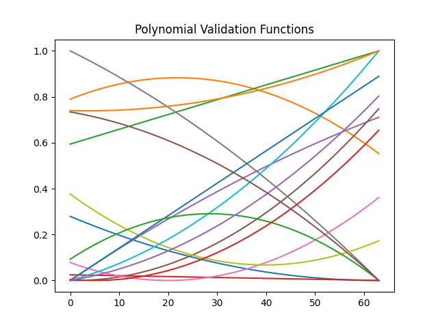
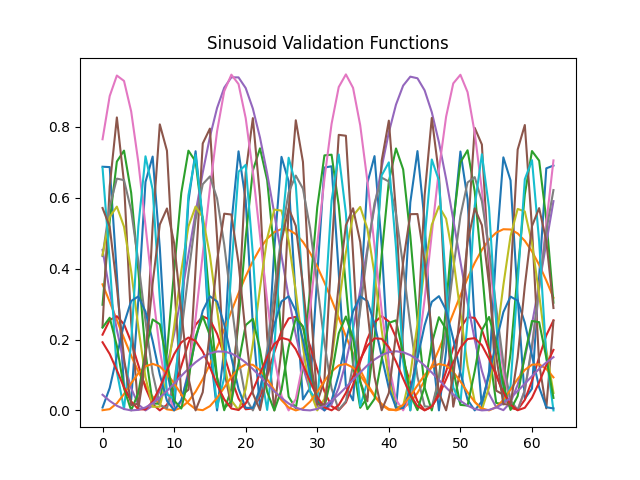
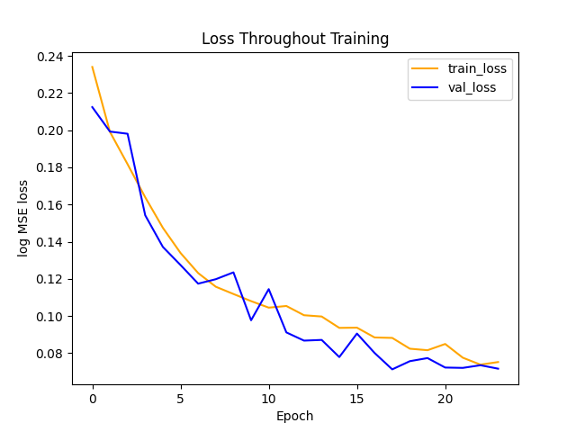
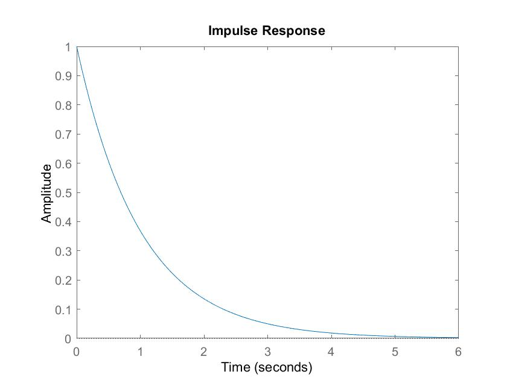
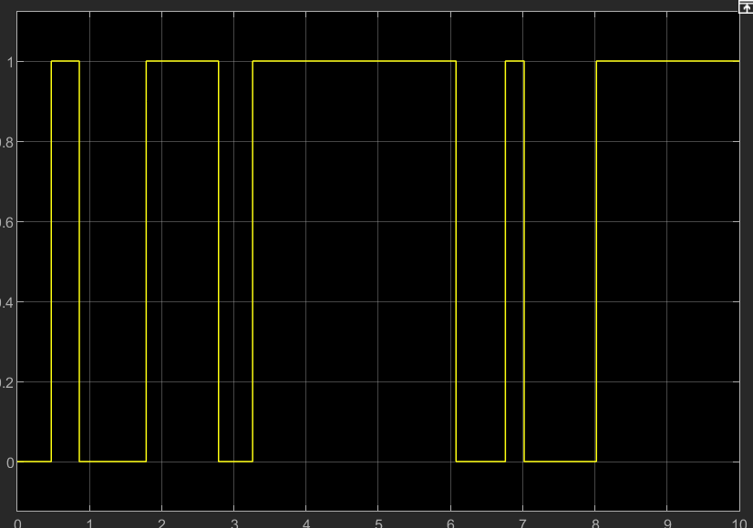
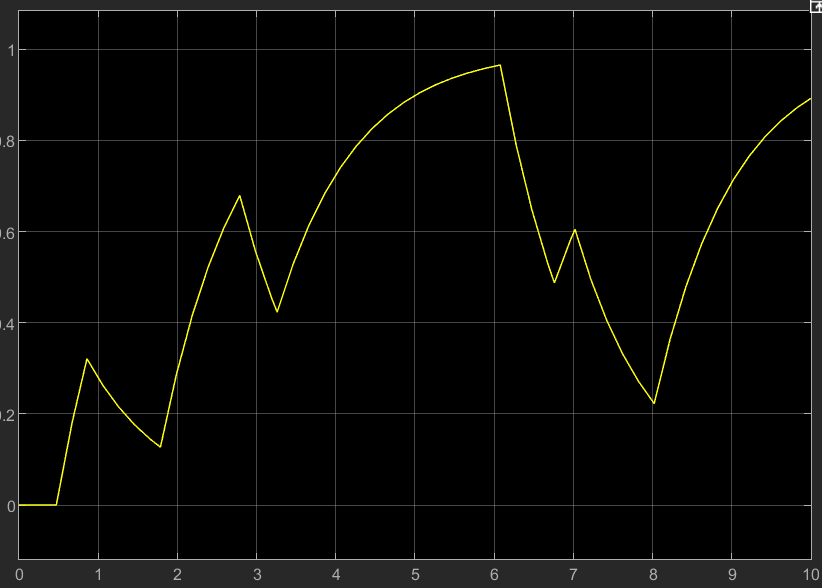

# LiNet

LiNet is a neural net architecture that replaces the weights of a standard feed-forward network with linear transfer functions. This allows the network to operate on online time-series data more efficiently than existing convolutional approaches, and train more efficiently than existing recurrent approaches.

## Information

The CUDA/C++ optimized version of the network is still a work in progress, so all usable code is currently found in the /py folder.

### linet.py

Defines the LiNet class and contains the methods for forward and backwards propogation, as well as other useful methods and information.

### linet_helpers.py

Defines constants and helper functions for the LiNet class and other files.

### train.py

Defines the train function, which allows the user to plug in an instance of the DataLoader class (also defined in this file) and perform gradient descent with variable batch size. The train function also provides checkpointing functionality.

### main.py

Currently serves as an example of training the network to classify sinusoidal functions from 2nd-order polynomial functions, described below.

## Example

Using a network with the following parameters:
 - num_hidden = 4
 - num_steps = 64
 - default constants seen in linet.py
 - ELU activation function

and training/data with the following parameters:
 - num_steps = 64
 - classifier = true
 - batch_size = 1
 - n_train = 64 of each type
 - n_val = 16 of each type
 - learning_rate = 1e-4

to classify between 2nd-order polynomials:

and sinusoidal waves:

the mean-squared error (given a sigmoidal activation on the last layer, with a 1 label representing a sinusoid and a 0 representing a polynomial) on both the training sets and the validation sets can be seen converging (note that this graph shows mean MSE loss, not log MSE loss):

This is obviously a small and simple example, but it shows that the network is able to learn non-arbitrary tasks. As progress continues I hope to create a much more impressive example. 
 

## TODO:
 1. Fix activation function on output layer of network (currently worked around in training function)
 2. Implement parallel batches in backwards pass.
 3. Add option for bias value in transfer function layers.
 4. Add option to regularize gain and gamma weights.
 5. Modularize the network to allow more configurable layer sizes, activation functions, and mix in other types of layers.
 6. Use imaginary axis to implement double-pole transfer functions.
 7. Add feedback/long-term-memory connections to generalize away from feed-forward convolution.

## Theory

Linear transfer functions come from the field of control theory, and are abstractions of real world systems. The most simple transfer function is DC-gain, which only multiplies the input by some constant to get the output (in the context of deep learning, this represents regular 'weights' used in feed-forward networks). The next step up in complexity is what LiNet currently uses: the single-pole transfer function.

The single-pole transfer function is the solution to the dynamics equation x' + ax = F. Systems described by this equation include the charge of a transistor with relation to voltage, and the velocity of an object moving through viscous friction with respect to force.

Represented in the s-domain as k/(s-p), the single-pole transfer function represents the convolution of the input signal (often a force or a voltage, but in our case the input to a layer) with an exponential decay response function. It can be shown that through linear combinations of single-pole transfer functions, any arbitrary response function can be achieved. 

Example response function:

### Example of signal convolution:

Input:

Output:

The way that LiNet uses these transfer functions is to replace the regular weight matrix with a matrix of linear transfer functions. In the current PyTorch implementation, this requires three seperate matrices: the gain of each function, the decay value (specifically, exp(p) of the function, called gamma in the code), and the state of the function. The output to the next layer is the state of the function, computed using a simple multiply-accumulate: y(t) = k * exp(p) * y(t-1) + x(t), where k * exp(p) must only be computed once.

Backpropogation is performed by convolving the loss gradients across each transfer function's impulse response backwards, while moving forward through time. The exact details of this process - and the measures that must be taken to prevent the accumulation of numerical error - are lengthy, and will be added here on a future date. For now, see LiNet.backwards in /py/linet.py for the implementation.

In this context, transfer functions are more computationally efficient than kernel-based approaches. Furthermore, since previous inputs are stored in superposition, only the current state of the network must be stored during inference - that is, we don't need to store previous states to re-convolve over them. This mean that LiNet has the exact same time and space inference complexity as a regular feed-forward network.

For convergence, the gains of each transfer function are have the same properties as regular linear weights, and the poles of the transfer function are guarenteed to have a convex loss function as long as all inputs to the transfer function are positive (formal proof not included here). For more generalized inputs, more work must be done to test the convergence properties of transfer function poles.

